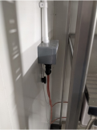
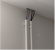
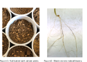

# The Microbiome Green Revolution's repository for maintaining Sampling Protocol Documentation

---

## Table of Contents
* [Safe Use of Controlled Environment Plant Rooms](#safe-use-of-controlled-environment-plant-rooms)
* [Field Sample Protocol - Needs Updating](#field-sample-protocol---needs-updating)
* [Gt Culturing Protocol](#gt-culturing-protocol)
  * [Protocol – Propagating cultures of Gt on PDA plates from a pure culture](#protocol--propagating-cultures-of-Gt-on-pda-plates-from-a-pure-culture)
  * [Protocol – Propagating cultures of Gt on selective media (SM-GGT3) from an environmental sample](#protocol--propagating-cultures-of-gt-on-selective-media-sm-ggt3-from-an-environmental-sample)
  * [Protocol – Inoculating particulate medium with Gt – prepare immediately prior to experiment](#protocol--inoculating-particulate-medium-with-Gt--prepare-immediately-prior-to-experiment)
* [Germinating (non-sterile) wheat in the controlled environment room](#germinating-non-sterile-wheat-in-the-controlled-environment-room)
* [Root or Soil Isolation of Gt - Rothamsted Protocol (Nov 2023)](#root-or-soil-isolation-of-gt---rothamsted-protocol-nov-2023)
  * [Cereal Root Isolation of Gaeumannomyces tritici](#cereal-root-isolation-of-gaeumannomyces-tritici)
  * [Seedling Bioassay - To recover Gaeumannomyces tritici isolates from Soil](#seedling-bioassay---to-recover-gaeumannomyces-tritici-isolates-from-soil)
* [Transportation of Gt Isolates - Rothamsted Protocol (March 2024)](#transportation-of-gt-isolates---rothamsted-protocol-march-2024)
* [Trial Protocol for Biocontrol of Gt](#Trial-Protocol-for-Biocontrol-of-Gt)
* [Workflow for WP1](#Workflow-for-WP1)
* [Field sampling protocol](Field-sampling-protocol)
* [DNA extraction protocol following manufacturers manual](DNA-extraction-protocol-following-manufacturers-manual)
* [DNA quantification using Quant-iT ™ dsDNA Broad-Range Assay Kit](DNA-quantification-using-Quant-iT-™-dsDNA-Broad-Range-Assay-Kit)
* [DNA normalisation for sequencing with Biofoundry](DNA-normalisation-for-sequencing-with-Biofoundry)
---

## Safe Use of Controlled Environment Plant Rooms

#### Safety
The electrical equipment (grow lights) in the CE room run at 240 V. A 240 V shock is enough to kill an adult.  
- Be on the alert for any signs of a faulty outlet. Shut power to the room immediately if you notice: 
  - Flickering lights  
  - A burning plastic smell, or discoloured/melting plastic on the outlet, plug, or wires 
  - Smoke or sparks from any component of the equipment 
  - Overheating outlets (they should not feel hot to touch) 
  - Loose plugs (don’t sit in the socket correctly) 
- DO NOT plug or unplug the grow lights without cutting power to the room
  
    

#### Cutting power to the CE Room – must be done from outside 
- Press the green button to cut power to the outlets (which power the grow lights and fans). The bulkhead (wall-mounted) light will stay on.  
- Turn the red knob to cut all power to the CE room.  

    

#### Steam-cleaning the CE Room 
- Press the green button to cut power to the room 
- Unplug and move the benches/light assemblies out of the room 
- Cover plug outlets with their attached covers 
- Use tape to cover the humidity sensors at the back of the room

    

- Use parafilm to tightly seal around the top of the PVC tubes covering red, black, and purple wires. This is to prevent any condensation from entering the tubes and causing a short 

    

- Use the steam cleaner to sanitise walls and floors. Wear eye protection and a lab coat, and remember not to touch the end of the appliance or direct the steam near any body parts – this vapour will be over 100°C!  

- Move the steam cleaner slowly and steadily over small sections of the wall 

- Use paper towels (or a paint roller, for areas you can’t reach) to wipe down all surfaces and remove any condensation  
- Wait until the room is completely dry before bringing the benches/light assemblies back inside. Don’t plug them in again unless the power to the room is cut!  
- Remove parafilm and tape from sensors and piping 
- Wipe down the benches themselves with Virkon. Wear appropriate PPE (eye protection, gloves, lab coat)

#### Other maintenance issues 
- Notify a PI or Paul Beasley immediately if you notice condensation on the ceiling pipes, or any water accumulating on the benches or floors 

#### Programming the CE Room
- You can program the room from the panel just outside the door, but if a circuit trips, the program will go back to its ‘default.’ Ask Paul Beasley to program the CE room from the central computer (we do not have access to this). 

---

## Field Sample Protocol - Needs Updating
**Field Protocol:**
1. Using satellite imagery (google maps) you can measure the length of the field from corner to corner. Do this to determine the length of the transect between sample points. E.g. if a field is 500m from corner to corner, the distance between sample points will be 50m.  

2. Navigate to your first field point.  

3.  Using the trowel dig a small hole to about 10cm depth, and place around 250g of soil into a labelled ziplock bag. Using the same trowel take a smaller amount of soil and place into the numbered bottle for the farmer kit sample, filling it about 1/10th of the way.  

4.  Using the spade dig up the roots of a one wheat plant. Gently shake any loose soil form the root ball but you want to keep most of it, place this in a labelled ziplock (cut of the stems of the wheat plant as close to the soil as possible).  

5.  One person then takes the transect out to the required length whilst the other holds the end of the transect in place at the first point.  

6.  Repeat the steps 3-5 until you are at your 10th and final sample for your first transect. 

7.  At this final sample, repeat all your sampling but also take an extra wheat root sample and place into the numbered bag for the farmer kit.  

8.  Return samples to car/pick up point.  

9.  Navigate to your next corner, which will be the start of the second transect.  

10.  Repeat all of the steps for the first transect, minus the extra soil and wheat samples for the farmer kits. (To clarify: you will only be taking samples to put into ziplocks on this transect) 

11.  Mark the field on google maps with a label so the location is noted.  

**Processing field samples:**

1. For all soil samples, they will be split into three sample bags.

2. Using a spoon take roughly 50g of soil from the field sample and place into a smaller ziplock bag for the -80 freezer.  

3.  Using the same spoon place roughly 50-70g of soil into a larger ziplock bag to be air dried. Roll the sides of this bag down and then place it where it will be out of the way to air dry for roughly a week (less if it was already quite dry). 

4.  The soil left in the field sample bag can be sealed and rolled up to be placed in the fridge.  

5.  Clean the spoon and area with 70% ethanol before moving on to the next sample and repeating.  

6.  With the wheat root samples, you will need to extract some of the roots using your (gloved) hands.  

7.  Gently pull the roots out of the sample and shake them to remove any excess soil (we only want to retain the rhizosphere soil).  

8.  Place the roots into a small ziplock for the -80 freezer. The remaining sample can be sealed and rolled up to be placed in the fridge.  

---
 

## Gt Culturing Protocol

#### Rationale:

This protocol describes how to propagate Gaeumannomyces graminis var tritici (Gt) cultures from pure culture, how to isolate Gt from infected roots, and how to inoculate Gt into a powdery medium for plant inoculation.

**[Note: Gt loses infectivity after several months without contact with a plant host. To avoid experimental bias, cultures should not be repeatedly propagated without plant contact]**

**Important!!** Fungal contamination can cause major issues for those working alongside you. Fungal spores are easily transmitted and can remain in the air and on surfaces for long periods of time, often infecting other lab cultures. This is very hard to deal with and can take months to clear from a laboratory. Please ensure that you stick to strict aseptic technique when working with fungus in the laboratory.  **Although Gt is not known to have airborne dispersal, you MUST check with PIs before attempting to culture any other fungus that may produce spores. Special containment procedures (other than those described below) may be required.**  

#### Reagents:
- Potato dextrose agar (Sigma) 
- Regular agar 
- Streptomycin sulfate 
- Oats 
- 1 mm sieve 
- For selective media, you will also need the reagents below. Please check the Waring Lab Chemical log for more information on the specific hazards associated with each. 
  - Dicloran (flammable, toxic vapor)  
  - Metalaxyl (harmful if swallowed) 
  - Hoe 00703 (1-)3,5-dichlorophenyl)-3-methoxymethyl-pyrrolidine-2,4-dion 
  - L-DOPA (harmful if swallowed)
  - Silver nitrate (oxidiser, harmful if swallowed, harmful to aquatic life) 

#### Equipment:
- Petri dishes
- Glass container 2X the volume of your media (2 L) 
- Aluminum foil for covering the container while it is autoclaving 
- Autoclave 
- Heat-resistant gloves 
- 70% ethanol 
- Balance + scoopula for weighing ingredients 
- Graduated cylinder (for measuring water) 
- Sealed waste containers 
- Secondary containment box for Gt cultures 

### Protocol – Propagating cultures of Gt on PDA plates from a pure culture

Steps 1-6 can be done in the Unit C laminar flow hood:
1. Thoroughly clean the cabinet with ethanol or 10% bleach 
2. Prepare 1/10th strength PDA 
   - Make a stock solution of PDA by adding 39 g of powder (containing 4 g/L potato extract, 20 g/L dextrose, and 15 g/L agar) to 1 L of water.  
        - Autoclave 15 minutes at 121° C. **Wear gloves** to remove media – it will be hot! 
   - Mix 100 mL of the stock solution with 900 mL of water. Add 13.5 g plain agar.  
        - Autoclave 15 minutes at 121° C. **Wear gloves** to remove media – it will be hot! 
3. When the mixture has cooled to 60° C, but while the solution is still liquid, add streptomycin (0.1 mg/mL, or 100 mg). Swirl to distribute the streptomycin evenly 
   - Note: this is easier is the streptomycin is pre-dissolved in a small volume (1 mL) of autoclaved water.  
4. Spray bench with 70% ethanol 
5. Label appropriate number of petri dishes with the date and type of media (10% PDA + strep) 
6. Pour into petri dishes (make sure there are no bubbles!) and cover.  
   - When the agar has set (allow 24 hours) turn petri dishes upside down, and store in the refrigerator at 4° C 

For the steps below, work in the MSC – you must have appropriate training before using this hood 

7. To inoculate, transfer a ‘plug’ of Gt pure culture to the centre of your petri dish 
8. Special considerations for removing cultures and/or waste materials from the MSC 
   - Once the petri dishes are inoculated with Gt they need to be sealed with parafilm and placed in secondary containment (a sealed box) inside the hood. Once the plates are in secondary containment the box can be sprayed with ethanol and removed from the hood.  
   - Please make sure that any waste that has had contact with fungal cultures is placed in a bag in the hood. This bag needs to be sealed before it is removed from the hood and then placed in an autoclave bag for sterilisation. 
9. Thoroughly clean the cabinet when you are finished with 10% bleach or 70% ethanol.  

### Protocol – Propagating cultures of Gt on selective media (SM-GGT3) from an environmental sample

Working in the chemical fume cupboard 
1. Prepare a solution of 10 mg dicloran, 10 mg metalaxyl, 25 mg Hoe 00703, 100 mg streptomycin sulfate, and 500 mg L-DOPA in 10 mL of sterile water in a sterile tube 

Steps 2-6 can be done in the Unit C laminar flow hood 
2. Thoroughly clean the cabinet with ethanol or 10% bleach 
3. Make a stock solution of PDA by adding 39 g of powder (containing 4 g/L potato extract, 20 g/L dextrose, and 15 g/L agar) to 990 mL of water.  
   - Autoclave 15 minutes at 121° C. **Wear gloves** to remove media – it will be hot! 
4. When the PDA media has cooled to 60° C, but while the solution is still liquid, add the solution prepared in step 1 
5. Spray bench with 70% ethanol 
6. Label appropriate number of petri dishes with the date and type of media (‘SM-Gt3’) 

For the steps below, work in the MSC – you must have appropriate training before using this hood 
7. Inoculate with environmental sample 
   - Wash inoculant (infected root tissue – the fungus will not culture from soil) well in running water, then disinfest with 1% silver nitrate for 30 seconds, followed by 3 rinses in sterile water 
   - Blot dry 
   - Place the inoculant on the surface of the plate and seal with parafilm 
   - Dispose of the silver nitrate in an appropriate chemical waste container 
8. When removing materials from the MSC, please follow ‘Special considerations for removing cultures and/or waste materials from the MSC’ as described above, and clean the MSC 

### Protocol – Inoculating particulate medium with Gt – prepare immediately prior to experiment
In the CE prep room 
1. Soak 150 mL of dry oats in water overnight, and decant the liquid (the oats should still be very moist) 
2. Autoclave oats for 1 hour at 121° C 

Work in the MSC – you must have appropriate training before using this hood 
3. Thoroughly clean the cabinet with ethanol or 10% bleach 
4. Mix ‘plugs’ of Gt culture with the oats in Petri dishes. You will need lots of replicate dishes to fit all the oats.  
5. Remove materials from the MSC, following Special considerations for removing cultures and/or waste materials from the MSC’ as described above, and clean the MSC 

In the CE prep room 
6. Incubate cultures for 4 weeks at 20° C (transfer Petri dishes directly from your secondary container into the incubator) 

For the next steps, return to the MSC  
7. Air-dry the now-infested oats by opening Petri dishes fully. The Petri dishes should still be inside the secondary container to prevent spillage within the MSC. Please label with appropriate signage (e.g. ‘oats + G. graminis var tritici, for air-drying [start date: X, end date: Y], your name’) 
8. After oats have dried, place the infested oats in a sealed plastic bag, then double-bag. Crush gently (e.g. with a rubber mallet). You want to obtain a powdery consistency.  
9. Sieve to remove fragments larger than 1.0 mm  
10. Remove materials from the MSC, following Special considerations for removing cultures and/or waste materials from the MSC’ as described above. Clean the MSC

#### References
- Juhnke ME et al. 1984. A selective media for Gaeumannomyces graminis var tritici. Plant Disease 68. 
- Carter et al 1999. Isolation, characterization, and avenacin sensitivity of a diverse collection of cereal-root-colonizing fungi. Appl Environ Microbiol 65:8 
- Mathre DE. 2000. Take-all disease on wheat, barley, and oats. Plant Health Progress DOI: 10.1094/PHP-2000-0623-01-DG

--- 

## Germinating (non-sterile) wheat in the controlled environment room

#### Rationale 

This protocol is used to quickly generate healthy, young wheat seedlings that can later be transplanted to larger pots for scientific experiments.  

**[Note: This protocol does NOT guarantee that the wheat seeds are sterile. All seeds will have microbes inside the seed coat, although sterilising the outside of the seed is recommended before starting. This protocol also calls for a non-sterile growing medium. You may need to alter this for your experimental purposes, e.g. by triple-autoclaving the JIC Cereal Compost Mix.]**

#### Equipment:
- 50 mL falcon tubes 
- 70% ethanol 
- 3% bleach 
- Wheat seeds 
- Petri dishes 
- Filter paper 
- 96 cell seed trays 
- 96 plant pots, 0.25 L, wiped down with 10% hypochlorite 
- JIC Cereal Compost Mix (may be available from Petersfield Growing, or make as follows) 
  - 40% medium grade peat 
  - 40% sterilised soil 
  - 20% sand 
  - 1.3 kg m-3 PG Mix 14-16-18+Trace Elements Base Fertiliser 
  - 1.0 kg m-3 Osmocoate Exact Mini 16-8-11 + 2MgO + Trace Elements 0.02% Boron  
  - H2Gro from ICL Specialty Fertilisers 
  - 3.0 kg m-3 Maglime  
- Plant tags (to indicate date seed trays were established)

#### Protocol:  
1. Seed sterilisation (if necessary) 
   - Add required number of seeds to 50 mL tube 
   - Submerge in 70% ethanol. Incubate for 30 seconds, then pour off 
   - Submerge in 3% bleach. Incubate for 10 minutes, then pour off 
   - Wash seeds in sterile distilled water 10X  
2. Place a filter paper in a Petri dish, and add about 40 wheat seeds on top 
3. Add enough water to dampen the filter paper, but ensure seeds are not floating in the water 
4. Seal the plate with Parafilm 
5. Leave at room temperature for 3-5 days until germinated, checking periodically to make sure the filter paper doesn’t dry 
6. Transfer germinated seeds to a 96-cell seed tray filled with the JIC Cereal Compost Mix, labelled with date of experiment.  
   - Use your finger to scrape a small well in the soil, and place the germinated seed in the well 
   - Cover the seed with soil, but make sure the coleoptile (tiny shoot) isn’t buried 
   - Place tray in the CE room under the following conditions: 
     - Light: 22 hours maximum intensity, 2 hours darkness 
     - Temperature: 22°C during the light period, 17°C during the dark period  
     - Humidity: 65% (can go up to 70%) 
   - Water regularly 

#### References
- Ghosh et al Nature Protocols DOI: 10.1038/s41596-018-0072-z
- ‘Growing Wheat.’ Updated November 2018. Accessed at: https://www.wheat-training.com/wp-content/uploads/Wheat_growth/pdfs/Growing_Wheat_final.pdf  

---

## Root or Soil Isolation of Gt - Rothamsted Protocol (Nov 2023)
This protocol should be carried in the lamina flow hood, all equipment used should be sterilised with 70% ethanol before and between each use. Gt isolates may be recovered from seedling/adult wheat roots or from soil cores in a seedling bioassay (refer to latter protocol). 

### Cereal Root Isolation of Gaeumannomyces tritici
1. Using a scalpel, on a white tile, cut roots displaying characteristic black necrotic lesions into pieces, approximately 1 cm in length, sterilising the equipment between samples. 
2. Place root pieces from an individual plant or soil core into a 7ml bijou bottle or small beaker and cover with a small volume of 5% sodium hypochlorite solution, swirl to cover and leave for 5 minutes. 
3. Pour the solution with the root piece into a tea strainer resting above a 1L beaker. 
4. Rinse the roots with sterile dH2O. 
5. Turn the root piece over in the tea strainer with sterile forceps. 
6. Rinse this side of the root piece with more sterile dH2O.  
7. Using the same forceps place the root piece on sterile filter paper and allow to dry for several minutes. 
8. Use the forceps to transfer the root piece onto a Potato Dextrose agar plate amended with ampicillin and streptomycin (100ug/ml;50ug/ml respectively) and apply a small amount of pressure to embed the root piece in the PDA, make sure the ends of the root especially are in contact with the media. Four root pieces can be put on a single 9cm  PDA plate. 
9. Wrap plates in parafilm and transfer to a 20°C incubator in the dark for 3-4 days until hyphae are visibly extending from the root piece.  Gt has characteristic ‘hooked’ hyphal tips to aid in identification. 
10. To obtain a pure culture hyphal tip recovered isolates. 

### Seedling Bioassay - To recover Gaeumannomyces tritici isolates from Soil
1. Collect 10cm soil cores from around the root base of plants or dig up plants and collect soil surrounding root ball. 
2. Invert core into an 11cm tall white plastic pot, previously drilled with four 3mm diameter drainage holes, and containing 50 cm3 of coarse sand.  
3. Bait with 10 wheat seeds (Fig 1) and cover with approximately 1 cm of horticultural grit.
 
   

4. Incubate in a controlled environment room with 16 h light cycle, 15°C day and 10°C night-time temperatures for 3 weeks.  
5. Water the cores from above and again twice a week on a Tuesday morning and a Friday afternoon. 
6. After 3 weeks remove the cores from the growth room,  twist the roots off at the soil-sand interface and wash the roots free of soil.  
7. Examine the roots for black take-all lesions in a white shallow dish whilst submerged in water. 
8. Proceed to recover Gt isolates using ‘Root  Isolation of Gauemannomyces tritici’ protocol above. 

    

Gail Canning, Rothamsted Research, Herts, AL5 2JQ, UK - November 2023  

---

## Transportation of Gt Isolates - Rothamsted Protocol (March 2024)
1. Wash the seedling roots free of soil.  
2. Examine the roots for black necrotic lesions in a white shallow dish whilst submerged in water. 
3. Select four seedling plants per pot whose roots contain  large black necrotic lesions distributed along the roots. If possible, select lesions in different positions along the root, avoiding lesions directly next to the seed or at the root tip. 
4. Using sterile scissors or a scalpel blade cut a lesion, approximately 1 - 1.5 cm in length, from a single root piece per plant. Sterilise the scissors/scalpel between each plant sample with 70% ethanol. 
5. Place the four root pieces from each pot into a 7ml sterile bijou bottle* labelled with the location and sample date and seal the lid tightly. 
6. Store the labelled samples at 4°C and send to Rothamsted Research on a weekly basis. 
   - Rothamsted will send you a stock of sterile bijou bottles to use. 
   - Please post the bottles on a Monday using 1st class royal mail, so that the  Gt isolations can take place at RRes by the end of the same week  
   - Please email Gail Canning  on the day the package is posted to indicate to Gail that a package is on its way. Email: gail.canning@rothamsted.ac.uk 
   - Postal address: Gail Canning, Wheat Pathogenomics Team, Rothamsted Research, Bawden Building, Harpenden, Herts AL5 2JQ

Gail Canning, Rothamsted Research, Herts, AL5 2JQ, UK - March 2024  

---
 

## Trial Protocol for Biocontrol of Gt

#### Objective: 
To assess biocontrol of Gt by the rhizosphere microbiome. The basis behind this is to provide evidence of microbiome-based biocontrol of Gt without isolating single bacterial or fungal strains.  

#### Method: 
1. Carefully uproot wheat samples and remove excess (bulk) soil by gently shaking roots and place in Ziploc bags. If awaiting processing, store roots at -80°C. To obtain the rhizo-microbiome, allow root samples to return to room temperature before transferring to sterile 50 mL Falcon tubes with either one of the following solutions.  

    A. Source- (Cohen et al., 2009)

Place roots in 50 mL Falcon tubes with 15 mL 1x phosphate buffer saline (PBS).  

- 10x PBS (/L)-
- KH2PO4		68.5g
- K2HPO4		5g
- MgSO4		2.4g
- pH		6.1 - 6.4 

    B. Source- (Nordstedt & Jones, 2020)

Place roots in 50 mL Falcon tubes with 15 mL sterile distilled water. 
2. Vortex for 5mins to loosen soil from roots. Using sterile forceps, carefully remove the roots, carefully pat dry and place them in new Ziploc bags before returning to -80°C. 
3. Serially dilute to 10-4 and using the spread plate method, inoculate onto PDA plates. Place a 5x5 mm-sized piece of Gt on the centre of the plate and incubate at 30°C for 5 days. (NOTE: store the remaining rhizo-microbiome wash in 25% glycerol stocks at -80°C) 
4. Monitor growth and inhibition if any.  

---
## Workflow for WP1

1.	Collect and process soil and wheat root samples as described here Field Sampling SOP updated.docx. 
2.	All metadata collected with the samples must be recorded and documented in the Metadata.xlsx file. Maintain a sample list in a Extraction master list.xlsx.
3.	Extract DNA for 16S and ITS sequencing following the instructions provided. 
4.	Quantify DNA as instructed for DNA quantification using Quant.docx.
5.	Normalise DNA to a concentration required for 16S and ITS sequencing following this protocol.

---

## Field sampling protocol
Imperial Team 
Rationale
The goal of this experiment is to assess Gt abundance in soils, and its co-occurrence with other taxa. 
We will attempt to quantify this in fields that vary in their:
•	climate and soil type
•	management (fertiliser, pesticide inputs)
•	crop rotation [this year, and for the past several years
•	take-all disease severity [this year, and for the past several years]
For our survey, the unit of replication is an individual field (there may be multiple fields sampled at a given farm, if the fields vary in management/ rotation/ disease severity). We wish to sample Gt DNA from topsoils (0-10 cm) AND to culture Gt from wheat roots.
Equipment and supplies
•	GPS
•	Plastic bags + sharpie [Label all samples using the postcode as guide. E.g. for Postcode SL5 7PY, use 7PY.01.XX where 7PY is the last 3 characters of the farm postcode; 01. is the field number (In the event that there are multiple fields to be sampled. If there is only one field, label should remain 01.) And XX is sample e.g. 18. So 7PY.01.18 is the 18th sample in the first field from the farm with postcode SL5 7PY. 
•	Soil auger (5 cm diameter) - will collect one sample of approx. 200 g when deployed to 10 cm depth
•	Spade
•	Ethanol (70%) in spray bottle + paper towels
•	Cooler with ice packs
•	Secateurs
•	Tape measure
NB: for our site visits, we must record all the information that we able to in addition to information provided by farmers via the survey and form. are also soliciting from farmers through the mail-in sampling campaign (next tab) - check with site/land manager.

Proposed by Tom and used for all sampling is the "X" design
1.	Using satellite imagery (e.g Google maps) measure the length of the field from corner to corner. Do this to determine the length of the transect and between sample points. E.g. if a field is 500m from corner to corner, the distance between sample points will be 50m.  
2.	Starting from one corner, use the trowel to dig a small hole to about 10cm depth, and place around 250g of soil into a labelled ziplock bag. Using the same trowel, take a smaller amount of soil and place into the numbered bottle for the replicate farmer kit sample, filling it about 1/10th of the way.  
3.	Using the spade dig up the roots of a one wheat plant. Gently shake off excess soil from the root ball but you want to keep most of it, place this in a labelled ziplock (cut off the stems of the wheat plant as close to the roots as possible).  
4.	One person then takes the transect out to the required length whilst the other holds the end of the transect in place at the first point.  
5.	Repeat the steps 3-5 until you are at your 10th and final sample for your first transect. 
6.	At this final sample, repeat all your sampling but also take an extra wheat root sample and place into the numbered bag for the replicate farmer kit.  
7.	Return samples to car/pick up point.  
8.	Navigate to the next corner, which will be the start of the second transect.  
9.	Repeat all the steps as for the first transect, minus the extra soil and wheat samples for the replicate farmer kits. 
N.B. You will only be taking samples to put into ziplocks on this transect.
10.	Store samples in cooler on ice for transport back to laboratory. 
N.B. The protocol above should yield 2 kg of soil per field
11.	Mark the field on google maps with a label so the location is noted.
N.B. Provide the farmer/ farm manager with the survey form or survey link to obtain farm history.  

Field Protocol- Farmer kits
Rationale
Ideally, we would have farmers replicate the sampling protocol performed by our team - but this is too time intensive and complex to be realistic. Therefore, we need to identify the 'minimum viable product' that a farmer could deliver, that would be a fair representation of the Gt status of a field (our unit of replication). Lin et al (1979) find that a simple diagonal sampling method, with 10 samples evenly spaced along the diagonal, is an acceptable sampling method for clustered disease distributions with incidence rates < 20 or > 80%.
The issue here is that fields vary in their size, and walking a full diagonal might be time-consuming. Also, how should we direct the farmer to evenly space the sampling points when the diagonal would vary in size? Assuming a typical lower bound for field size is 4 ha, the diagonal of such a field would measure about 565 m. Again, assuming that 500 m = 650 paces for the typical adult, we could approximate the diagonal sampling design by having the farmer take a sample every 65 paces along a straight line, probably a tramline (to provide easy access), until 10 samples are collected. 
If we reduced the sampling interval to 10 paces, we'd obtain much lower coverage of the whole field (diagonal of ~80 m) but it might be worth it to reduce farmer effort. This is the approach adopted below. 

Equipment and supplies
Provided in the kit
•	Ziploc bags for wheat root (pre-labelled)
•	Graduated soil bottle (pre-labelled) 
•	Trowel
Farmer provided
•	Secateurs

Method
N.B.
a.	You may access the field from any point, but we recommend starting at the beginning of a tramline, to make it easier to walk a distance of ~100 m into the field.
b.	Each sampling kit corresponds to one field.
c.	Kit will have a QR code for farmers to answer specific questions about their field.

1.	Use the gardening spade to scoop a small amount of soil into the container. Make sure you are sampling soils in the crop and not in the tramline. Try to ensure you're digging into the soil to a depth of approximately 10 cm.
2.	Walk 10 paces and repeat step 1 placing soil in the same sampling bottle. 
3.	Repeat until you have collected from 10 points in total and walked 100 paces.
N.B. All the soil should all be put into the same container 
4.	At the last sampling point, dig up a single wheat plant and place it into the provided plastic bag. 
N.B. Important: We are mostly interested in the roots and the soil that sticks to the roots, so you can cut off the top of the plant to make it fit. Don't try to remove soils from around the roots!

References
Lin CS, Poushinsky G, Mauer M. 1979. An examination of five sampling methods under random and clustered disease distributions using simulation. Can J Plant Sci 59: 121-130 https://doi.org/10.4141/cjps79-017					
Processing field samples:  
1.	For all soil samples, they will be split into three sample bags.  
a.	Using a spoon take roughly 50g of soil from the field sample and place into a smaller ziplock bag for the -80°C freezer.  
b.	Using the same spoon place roughly 50-70g of soil into a larger ziplock bag to be air dried. Roll the sides of this bag down and then place it where it will be out of the way to air dry for roughly a week (less if it was already quite dry). 
c.	The soil left in the field sample bag can be sealed and rolled up to be placed in the fridge.  
5.	Clean the spoon and area with 70% ethanol before moving on to the next sample and repeating.  
6.	With the wheat root samples, you will need to extract some of the roots using your (gloved) hands.  
7.	Gently pull the roots out of the sample and shake them to remove any excess soil (we only want to retain the rhizosphere soil).  
8.	Place the roots into a small ziplock for the -80°C freezer. The remaining sample can be sealed and rolled up to be placed at 4°C in the fridge.  
 
---

## DNA extraction protocol following manufacturers manual 

Zymo research DNA™ Fecal/Soil Microbe 96 Kit (Catalogue number D6011)
DNA from fecal, soil, and microbial samples.
For optimal performance, add beta-mercaptoethanol (user supplied) to the Genomic Lysis Buffer to a final dilution of 0.5% (v/v) i.e., 750μl per 150 ml.- This was not added 

1. Add ≤135 mg of soil to the tubes of a ZR BashingBead™ Lysis Rack (0.1 & 0.5 mm). Add 400 μl BashingBead™ Buffer to each tube and cap tightly.
2. Secure in a bead beater fitted with the appropriate holder assembly for your bead beating module and process using optimized beat beating conditions (speed and time) for your device (see Appendix).
3. Centrifuge the ZR BashingBead™ Lysis Rack (0.1 & 0.5 mm) at ≥ 3,000 x g (5,000 x g max.) for 5 minutes.
4. Transfer up to 250 μl supernatant to each well of a 96-Well Block.
5. Add 500 μL of Genomic Lysis Buffer and 250 μL 95% ethanol to the filtrate in the 96-Well Block from Step 4. Cover completely with Cover Foil and mix thoroughly by vortexing for 2 minutes. Centrifuge the 96-Well Block at ≥ 3,000 x g (5,000 x g max.) for 5 minutes.
6. Remove or pierce foil and transfer 500 μl from the wells of Step 5 to the wells1 of a Silicon-A™ Plate, mounted on a Collection Plate. Centrifuge the assembly at ≥ 3,000 x g (5,000 x g max.) for 5 minutes. 
1Be careful to avoid pipetting debris that can clog the wells of the Silicon-A™ Plate.
7. Discard the flow-through from the Collection Plate and repeat Step 6.
8. Add 200 μl DNA Pre-Wash Buffer to the wells of the Silicon-A™ Plate, mounted on the emptied Collection Plate, and centrifuge the assembly at ≥ 3,000 x g for 5 minutes.
9. Add 500 μl g-DNA Wash Buffer to the wells of the Silicon-A™ Plate on the Collection Plate and centrifuge the assembly at ≥ 3,000 x g for 5 minutes.
10. Prepare the Silicon-A™-HRC Plate3 by mounting it on an Elution Plate. Add 150 μl Prep Solution to the wells by piercing through the Cover Foil. Incubate at room temperature for 5 minutes and centrifuge the assembly at exactly 3,500 x g for 5 minutes.
11. Place the Silicon-A™ Plate directly onto a prepared Silicon-A™-HRC Plate, and then mount the assembly on a new Elution Plate (this new assembly is a 3-plate stack).
12. Add 100 μl (50 μl minimum) DNA Elution Buffer directly to the matrices to the Silicon-A™ Plate on top. Centrifuge the assembly at exactly 3,500 x g for 3 minutes. Eluted, ultra-pure DNA is now ready for use in your experiments, or the Elution Plate can be covered with Cover Foil for storage of the DNA.
 

---

## DNA quantification using Quant-iT ™ dsDNA Broad-Range Assay Kit 

Quant-iT ™ dsDNA Broad-Range Assay Kit (Catalog no. Q33130) 
Following manufacturers manual:
1.	Make a working solution by diluting Quant-iT™ dsDNA BR reagent 1:200 in Quant-iT™ dsDNA BR buffer. For example, for ~100 assays put 100 μL of Quant-iT™ dsDNA BR reagent (Component A) and 20 mL of Quant-iT™ dsDNA BR buffer (Component B) in a disposable plastic container and mix well. Do not use glass containers. Do not use buffers other than the Quant-iT™ dsDNA BR buffer to make the working solution. 
2.	Load 190 μL (195 μL for unknown samples) of the working solution into each microplate well. Diluted Quant-iT™ dsDNA BR reagent is stable for at least 3 hours at room temperature, protected from light. 
3.	Add 10 μL of each λ DNA standard (Component C) to separate wells and mix well. Take care not to introduce nucleases into the tubes of DNA standard as you remove aliquots for the assay. Duplicates of the standards are recommended. 
4.	Add 5 μL of each unknown DNA sample to separate wells and mix well. 
5.	Using the microplate reader, measure the fluorescence excitation/emission at 485/20,528/20 nm. Standard fluorescein wavelengths are appropriate for this dye. The fluorescence signal is stable for 3 hours at room temperature. 
6.	Use a standard curve to determine the DNA amounts. For the λ DNA standards, plot amount vs. fluorescence, and fit a straight line to the data points.
More information from manufacturer can be found online https://tools.thermofisher.com/content/sfs/manuals/Quant_iT_dsDNA_BR_Assay_UG.pdf 

---

## DNA normalisation for sequencing with Biofoundry

After quantification using the Quanti BR kit, adjust DNA concentration for sequencing.
1.	Calculate the amount of DNA and sterile nuclease free water is required for an end concentration of 1g/L. 
2.	Add respective sterile nuclease free water into each well. Add the corresponding DNA from the initial DNA extracted. 
3.	Take care not to cross contaminate samples. Leave wells G12 and H12 empty (as instructed by Biofoundry).

---

